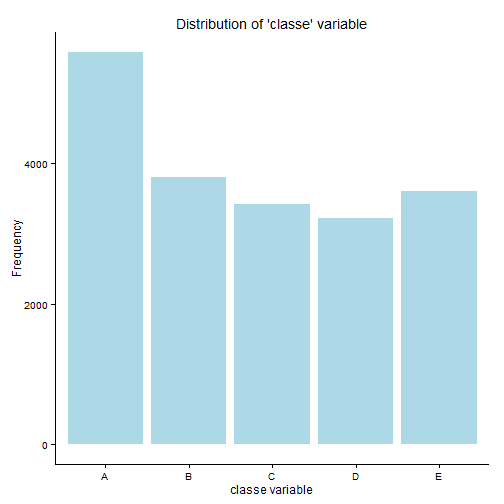
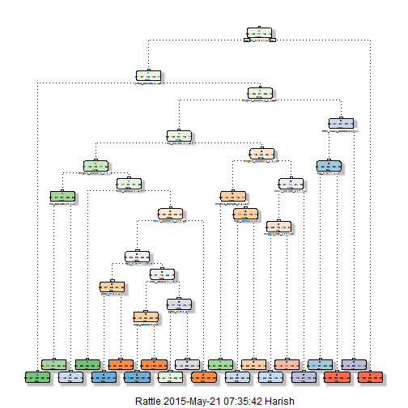

### Universal

```r
echo = TRUE
set.seed(1)
```

### Report Content
This is the report for the Machine Learning Project posted on Practical Machine Learning module of the Data Science Specialisation offered by The Johns Hopkins Univeristy through Coursera.

##Synopsis


Using devices such as Jawbone Up, Nike FuelBand, and Fitbit it is now possible to collect a large amount of data about personal activity relatively inexpensively. In this project, the  data comes from accelerometers on the belt, forearm, arm, and dumbell of 6 participants. They were asked to perform barbell lifts correctly and incorrectly in 5 different ways.

The goal of the project is to predict the manner in which they did the exercise. This is the "classe" variable in the training set. 

## Data
The data for this assignment was downloaded from the course web
site:

* Training Dataset: https://d396qusza40orc.cloudfront.net/predmachlearn/pml-training.csv
* Testing Dataset: https://d396qusza40orc.cloudfront.net/predmachlearn/pml-testing.csv

## Loading and preprocessing the data

dplyr package is used to organise the data while caret is used for pre processing and randomForest for building a classification model 

```r
echo = FALSE
library(dplyr)
```

```
## 
## Attaching package: 'dplyr'
## 
## The following object is masked from 'package:stats':
## 
##     filter
## 
## The following objects are masked from 'package:base':
## 
##     intersect, setdiff, setequal, union
```

```r
library(caret)
```

```
## Warning: package 'caret' was built under R version 3.1.3
```

```
## Loading required package: lattice
## Loading required package: ggplot2
```

```r
library(rattle)
```

```
## Warning: package 'rattle' was built under R version 3.1.3
```

```
## Rattle: A free graphical interface for data mining with R.
## Version 3.4.1 Copyright (c) 2006-2014 Togaware Pty Ltd.
## Type 'rattle()' to shake, rattle, and roll your data.
```

```r
library(rpart)
```

```
## Warning: package 'rpart' was built under R version 3.1.3
```

```r
train <- read.csv("pml-training.csv",stringsAsFactors = FALSE,na.strings=c("","NA","#DIV/0!"))
test <- read.csv("pml-testing.csv",stringsAsFactors = FALSE)
```


## What is the distribution of the "classe" variable?
The distribtion of the classe variable in the training set will help one understand the spread and scope of the problem

```r
l <- as.data.frame(table(train$classe))
plot1 <- ggplot(l,aes(x=l[,1],y = l[,2]))+geom_bar(stat = "identity",fill = "light blue")
plot1 <- plot1+xlab("classe variable")+ylab("Frequency")
plot1 + theme_classic()+ggtitle("Distribution of 'classe' variable")
```

 


## Data cleansing and engineering

After understanding the spread, I went on cleaning the data. 

* The time variable is cleaned and the day and hour variables are extracted from it
* Certain variables which had a very high proportion of NA's - User name, time stamp etc were turned off
* Prinicpal Component Analysis was performed to identify the variables that explain 95% of the variability
* All this was done after combining the training and testing set

Note that the feature engieering (dropping variables which were significantly "NAs" and PCA) resulted in the number of predictor variables dropping to 26 from 159


```r
data <- rbind(train[,-160],test[,-160])

m <- c()
for (i in 1:159) { ifelse(sum(is.na(data[,i])),1,m <- c(m,i))}
t <- data[,m]

t$time <- strptime(t$cvtd_timestamp,"%d/%m/%Y %H:%M")
t$hour <- t$time$hour
t$day <- t$time$wday

t$X = NULL
t$user_name = NULL
t$raw_timestamp_part_1 = NULL
t$raw_timestamp_part_2 = NULL
t$cvtd_timestamp  = NULL
t$time  = NULL
t$new_window = NULL

y <- preProcess(t[2:54],method = "pca")
tr <- predict(y,t[2:54])
tr$classe <- t$classe
tr$hour <- t$hour
tr$day <- t$day
```

After this the training and the testing set are seprated again


```r
train1 <- head(t,nrow(train))
train1$classe <- train$classe
test <- tail(t,nrow(test))
```

## Model Building
Once the feature engineering is done, I proceeded with developing models to understand the importance of the different variables.

I decided to first build a CART model to understand how the variables interact with each other 


```r
mod <- rpart(as.factor(classe)~.,data=train1,method="class")
fancyRpartPlot(mod)
```

 

After understanding the interaction, I decided to build a random forest model.
The reasons for choosing random forest model were:

* Good experience in the past in successfully applying RF for classification problems
* More accurate than the CART model
* Relatively faster

## Cross Validation

In order to validate the accuracy of the prediction, I decided to do a cross validation by paritioning the training set in to 2 sets.

This is done as follows


```r
mod <- createDataPartition(y=train1$classe, p=0.6, list=FALSE)
train_cv <- train1[mod, ]; test_cv <- train1[-mod, ]
dim(train_cv); dim(test_cv)
```

```
## [1] 11776    56
```

```
## [1] 7846   56
```

Proceeding with the random forest model, I have decided to use a 5 fold cross validation as under


```r
controlRf <- trainControl(method="cv", 5)
mod <- train(as.factor(classe) ~ ., data=train_cv, method="rf", trControl=controlRf, ntree=250)
```

```
## Loading required package: randomForest
```

```
## Warning: package 'randomForest' was built under R version 3.1.3
```

```
## randomForest 4.6-10
## Type rfNews() to see new features/changes/bug fixes.
## 
## Attaching package: 'randomForest'
## 
## The following object is masked from 'package:dplyr':
## 
##     combine
```

```r
mod
```

```
## Random Forest 
## 
## 11776 samples
##    55 predictor
##     5 classes: 'A', 'B', 'C', 'D', 'E' 
## 
## No pre-processing
## Resampling: Cross-Validated (5 fold) 
## 
## Summary of sample sizes: 9420, 9420, 9422, 9422, 9420 
## 
## Resampling results across tuning parameters:
## 
##   mtry  Accuracy   Kappa      Accuracy SD   Kappa SD   
##    2    0.9919327  0.9897943  0.0007950425  0.001005151
##   28    0.9957537  0.9946287  0.0015322461  0.001938286
##   55    0.9895541  0.9867863  0.0034998329  0.004427060
## 
## Accuracy was used to select the optimal model using  the largest value.
## The final value used for the model was mtry = 28.
```

```r
pred <- predict(mod, test_cv)
```

The accuracy and out of stock error is given by the confusion matrix

```r
confusionMatrix(pred, test_cv$classe)
```

```
## Confusion Matrix and Statistics
## 
##           Reference
## Prediction    A    B    C    D    E
##          A 2231    5    0    0    0
##          B    0 1511    3    0    2
##          C    0    1 1365    4    0
##          D    0    1    0 1281    1
##          E    1    0    0    1 1439
## 
## Overall Statistics
##                                           
##                Accuracy : 0.9976          
##                  95% CI : (0.9962, 0.9985)
##     No Information Rate : 0.2845          
##     P-Value [Acc > NIR] : < 2.2e-16       
##                                           
##                   Kappa : 0.9969          
##  Mcnemar's Test P-Value : NA              
## 
## Statistics by Class:
## 
##                      Class: A Class: B Class: C Class: D Class: E
## Sensitivity            0.9996   0.9954   0.9978   0.9961   0.9979
## Specificity            0.9991   0.9992   0.9992   0.9997   0.9997
## Pos Pred Value         0.9978   0.9967   0.9964   0.9984   0.9986
## Neg Pred Value         0.9998   0.9989   0.9995   0.9992   0.9995
## Prevalence             0.2845   0.1935   0.1744   0.1639   0.1838
## Detection Rate         0.2843   0.1926   0.1740   0.1633   0.1834
## Detection Prevalence   0.2850   0.1932   0.1746   0.1635   0.1837
## Balanced Accuracy      0.9993   0.9973   0.9985   0.9979   0.9988
```

## Output Generation


As one can see, the model has a high level of accuracy(> 99.7%) and very low out of sample error (< 0.30%) and hence I decided to apply the same to the actual test case. Also the code snippet from the module to write the CSV files is added here as well


```r
pred <- predict(mod,newdata=test)

pml_write_files = function(x){
  n = length(x)
  for(i in 1:n){
    filename = paste0("problem_id_",i,".txt")
    write.table(x[i],file=filename,quote=FALSE,row.names=FALSE,col.names=FALSE)
  }
}

pml_write_files(pred)
```


## Conclusion

The outputs generated in the previous step were submitted and the result was 100%. 

As a quick summary, following were the steps taken to achieve the perfect score
* Clean and reengineer the data - remove NAs and extract the date and hour variables 
* Apply 5 fold CV to tune the random forest model
* Observe the accuracy and the out of sample error
* On satisfying oneself with the accuracy, proceed to apply the model to the test case.


